# Gradient Descent Lab (Scientific Project Repo)

This repository is an implementation of gradient-based optimization methods across three classic problem families:

- **2D quadratic** objective (smooth, strongly convex)  
- **1D nonconvex** objective (multi-start behavior and local minima)  
- **Least-squares linear regression** (Diabetes dataset)

Implemented methods:

- fixed-step **Gradient Descent**
- theorem-based stepsize choice via smoothness constant (**1/L**)
- **SciPy** baseline solver (**BFGS**)
- **Exact line search** for least squares
- **Backtracking Armijo line search**

---

## Install

```bash
python -m venv .venv
source .venv/bin/activate
pip install -r requirements.txt
```

---

## Reproduce all figures

```bash
python scripts/make_all.py
```

All plots are saved into:

- `figures/`

---

## Results Gallery (15 figures)

### Quadratic (2D)

1. **Objective surface**  
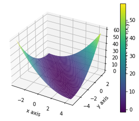

2. **Objective contours**  
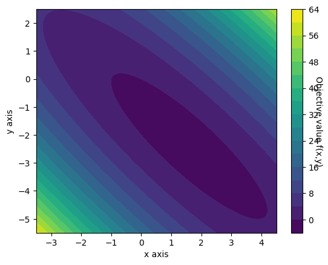

3. **Contour plot with a single reference point**  
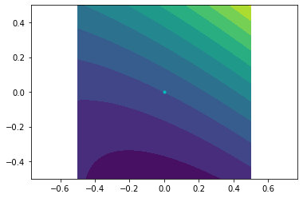

4. **Gradient Descent trajectory (α = 0.5)**  
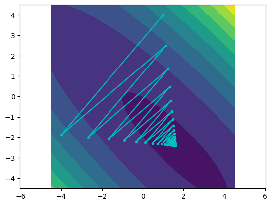

5. **Gradient Descent trajectory (α = 1.0)**  
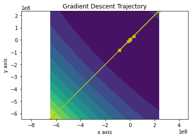

6. **Gradient Descent trajectory (α = 1/L)**  
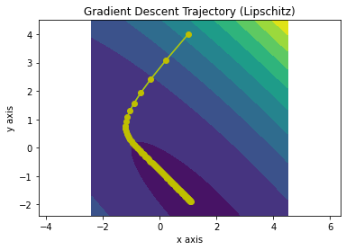

7. **Optimality gap (α = 0.5 vs α = 1/L)**  
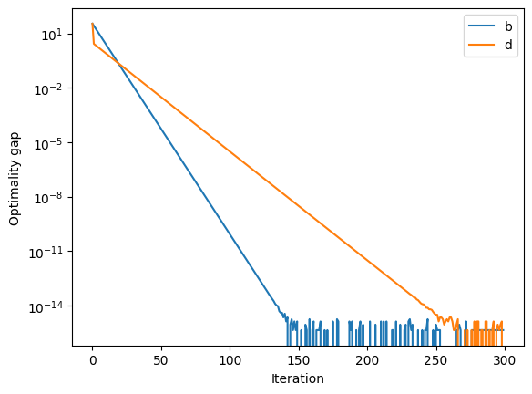

8. **SciPy solver iterates on contour plot**  
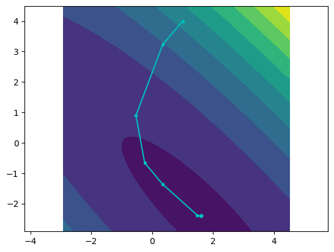

9. **Optimality gaps: SciPy vs GD**  
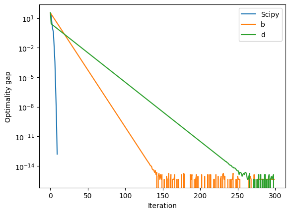

### Nonconvex (1D)

10. **Multi-start histogram summary (minimizers and objective values)**  
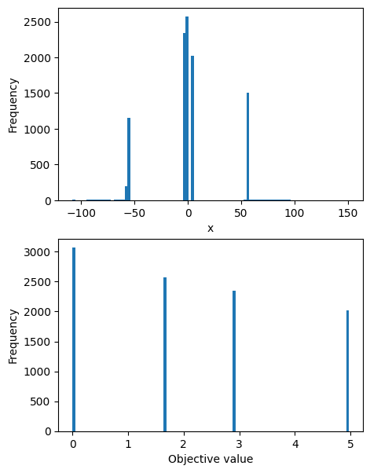

11. **Objective function with detected local minima**  
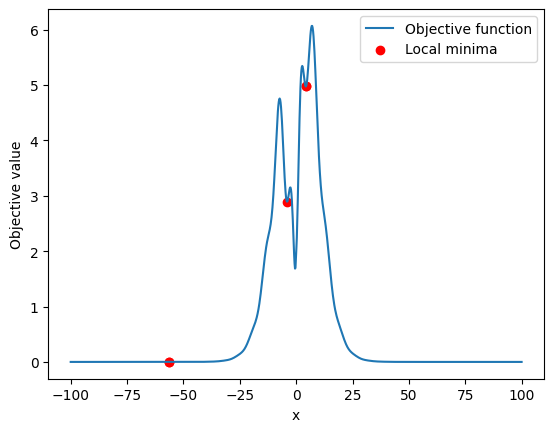

### Least Squares (Diabetes dataset)

12. **Fixed-stepsize GD: optimality gaps**  
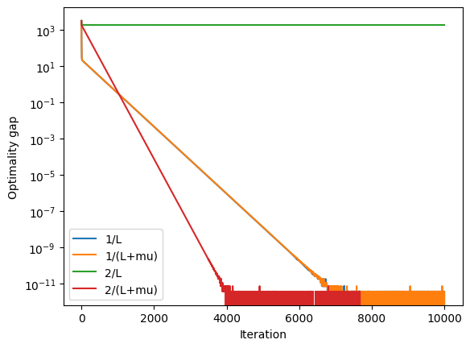

13. **Fixed steps vs Exact line search**  
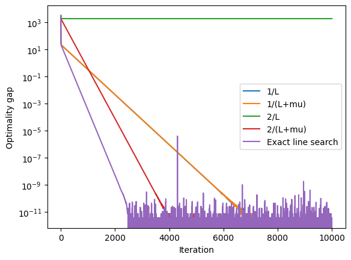

14. **Fixed steps vs Exact line search vs Backtracking**  
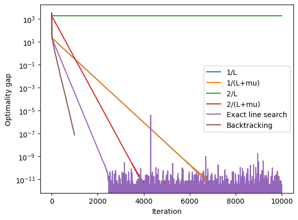

15. **Stepsizes over iterations (Exact vs Backtracking)**  
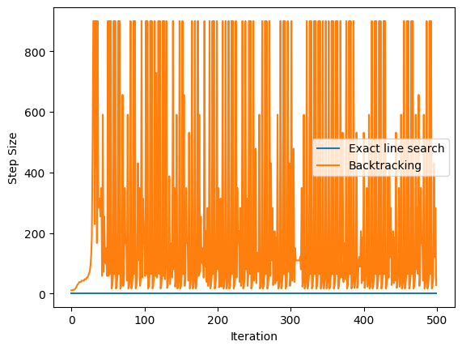

---

## Tests

```bash
pytest -q
```

The test suite includes:
- finite-difference gradient checks for the quadratic
- descent sanity checks
- Armijo condition verification for backtracking
- decrease check for exact line search on least squares

---

## Citation

If you use this repository as a reference, please cite via `CITATION.cff`.
